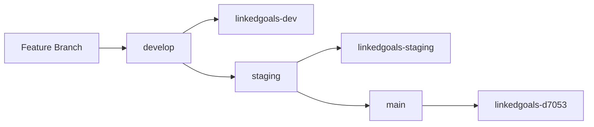

# Firebase Multi-Environment Setup - Implementation Summary

## 🎯 Overview

I've successfully created a comprehensive Firebase multi-environment setup for your LinkedGoals MVP project. This setup provides proper separation between development, staging, and production environments with automated CI/CD pipelines.

## ✅ What Has Been Created

### 1. Project Structure Updates

#### Firebase Configuration
- **`.firebaserc`** - Updated with project aliases for all three environments
- **`firestore.rules.dev`** - Development Firestore rules (permissive for testing)
- **`firestore.rules.staging`** - Staging Firestore rules (production-like)
- **`firestore.rules`** - Production rules (existing, strict security)

#### Environment Configuration
- **`src/config/firebase-dev.ts`** - Development Firebase configuration
- **`src/config/firebase-staging.ts`** - Staging Firebase configuration  
- **`src/config/firebase-prod.ts`** - Production Firebase configuration
- **`src/config/index.ts`** - Dynamic configuration loader
- **`src/vite-env.d.ts`** - Updated TypeScript definitions for environment variables

#### Environment Variables
- **`.env.development`** - Development environment variables
- **`.env.staging`** - Staging environment variables
- **`.env.production`** - Production environment variables

### 2. GitHub Actions Workflows

#### Deployment Pipelines
- **`.github/workflows/deploy-dev.yml`** - Automated deployment to development
- **`.github/workflows/deploy-staging.yml`** - Automated deployment to staging
- **`.github/workflows/firebase-hosting-merge.yml`** - Updated production deployment

#### Workflow Features
- Environment-specific builds
- Comprehensive testing for production/staging
- Security audits
- Automatic deployments on branch pushes

### 3. Package.json Scripts

#### Build Scripts
- `npm run build:dev` - Build for development
- `npm run build:staging` - Build for staging  
- `npm run build:prod` - Build for production

#### Deployment Scripts
- `npm run deploy:dev` - Deploy to development
- `npm run deploy:staging` - Deploy to staging
- `npm run deploy:prod` - Deploy to production

#### Testing Scripts
- `npm run test:dev` - Test in development mode
- `npm run test:staging` - Test in staging mode
- `npm run test:prod` - Test in production mode

#### Emulator Scripts
- `npm run emulators:dev` - Start dev environment emulators
- `npm run emulators:staging` - Start staging environment emulators

### 4. Automation Scripts

#### Setup Scripts
- **`scripts/create-firebase-projects.sh`** - Automated Firebase project creation
- **`scripts/deploy-environment.sh`** - Manual deployment script for all environments

#### Documentation
- **`scripts/setup-github-secrets.md`** - Complete guide for GitHub secrets setup
- **`docs/FIREBASE_ENVIRONMENT_SETUP.md`** - Comprehensive environment setup guide

### 5. Updated Documentation

#### Core Documentation
- **`README.md`** - Updated with multi-environment information
- **`docs/FIREBASE_ENVIRONMENT_SETUP.md`** - Complete setup guide with troubleshooting

## 🚀 Next Steps to Complete Setup

### Step 1: Create Firebase Projects

Run the automated setup script:

```bash
# Make script executable (if needed)
chmod +x scripts/create-firebase-projects.sh

# Create Firebase projects
./scripts/create-firebase-projects.sh
```

### Step 2: Update Firebase Configurations

After creating the projects, you'll need to update the configuration files with real Firebase project details:

1. **Get Firebase configs** for each project:
   ```bash
   # Get development config
   firebase use linkedgoals-dev
   firebase apps:sdkconfig web
   
   # Get staging config  
   firebase use linkedgoals-staging
   firebase apps:sdkconfig web
   ```

2. **Update configuration files**:
   - Replace placeholder values in `src/config/firebase-dev.ts`
   - Replace placeholder values in `src/config/firebase-staging.ts`

### Step 3: Set Up LinkedIn OAuth Apps

Create separate LinkedIn applications for each environment:

1. **Development App**: `LinkedGoals Dev`
   - Redirect URI: `https://linkedgoals-dev.web.app/auth/callback`
   - Redirect URI: `http://localhost:5173/auth/callback`

2. **Staging App**: `LinkedGoals Staging`
   - Redirect URI: `https://linkedgoals-staging.web.app/auth/callback`

3. Update environment files with client IDs:
   - `.env.development`
   - `.env.staging` 
   - `.env.production`

### Step 4: Configure GitHub Secrets

Follow the detailed guide in `scripts/setup-github-secrets.md`:

1. Create service accounts for each environment
2. Generate Firebase CI tokens
3. Add all secrets to GitHub repository
4. Set up GitHub environments with protection rules

### Step 5: Create GitHub Branches

Create the required branches for automated deployments:

```bash
# Create and push develop branch
git checkout -b develop
git push origin develop

# Create and push staging branch  
git checkout -b staging
git push origin staging
```

### Step 6: Deploy Security Rules

Deploy environment-specific Firestore rules:

```bash
# Deploy development rules
firebase use dev
firebase deploy --only firestore:rules

# Deploy staging rules
firebase use staging  
firebase deploy --only firestore:rules

# Production rules are already deployed
```

### Step 7: Test Deployments

Test each environment:

```bash
# Test development deployment
./scripts/deploy-environment.sh dev

# Test staging deployment
./scripts/deploy-environment.sh staging

# Test production deployment  
./scripts/deploy-environment.sh prod
```

## 🔧 Environment Structure

### Development Environment (`linkedgoals-dev`)
- **Purpose**: Local development and feature testing
- **Security**: Permissive rules for easier development
- **Emulators**: Enabled for local development
- **Branch**: `develop`
- **URL**: https://linkedgoals-dev.web.app

### Staging Environment (`linkedgoals-staging`)  
- **Purpose**: Pre-production testing and QA
- **Security**: Production-like rules with test data
- **Testing**: Full test suite + E2E tests
- **Branch**: `staging`
- **URL**: https://linkedgoals-staging.web.app

### Production Environment (`linkedgoals-d7053`)
- **Purpose**: Live production application
- **Security**: Strict security rules
- **Testing**: Full test suite + security audit
- **Branch**: `main`
- **URL**: https://linkedgoals-d7053.web.app

## 📋 Deployment Workflow



1. **Feature Development**: Create feature branches from `develop`
2. **Development Testing**: Merge to `develop` → Auto-deploy to dev environment  
3. **Staging Testing**: Merge to `staging` → Auto-deploy to staging environment
4. **Production Release**: Merge to `main` → Auto-deploy to production

## ⚠️ Important Notes

### Configuration Placeholders

Several configuration files contain placeholder values that need to be replaced:

- `src/config/firebase-dev.ts` - Replace `YOUR_DEV_*` values
- `src/config/firebase-staging.ts` - Replace `YOUR_STAGING_*` values
- `.env.development` - Replace LinkedIn client ID
- `.env.staging` - Replace LinkedIn client ID  
- `.env.production` - Replace LinkedIn client ID

### GitHub Secrets Required

The following secrets must be configured in GitHub:

#### Development
- `FIREBASE_SERVICE_ACCOUNT_DEV`
- `FIREBASE_TOKEN_DEV`

#### Staging  
- `FIREBASE_SERVICE_ACCOUNT_STAGING`
- `FIREBASE_TOKEN_STAGING`

#### Production
- `FIREBASE_SERVICE_ACCOUNT_PROD`
- `FIREBASE_TOKEN_PROD`

## 🎉 Benefits of This Setup

### Development Benefits
- **Isolated Testing**: Each environment is completely separate
- **Safe Development**: Changes can't affect production
- **Emulator Support**: Local development with Firebase emulators
- **Automated Testing**: Different test suites for each environment

### Operational Benefits
- **Automated Deployments**: Push-to-deploy workflow
- **Environment Promotion**: Clear promotion path from dev → staging → prod
- **Security**: Environment-specific security rules and configurations
- **Monitoring**: Separate monitoring and logging for each environment

### Team Benefits  
- **Parallel Development**: Multiple features can be developed simultaneously
- **QA Testing**: Dedicated staging environment for testing
- **Production Safety**: Multiple layers of testing before production
- **Easy Rollbacks**: Firebase hosting rollback capabilities

## 📚 Additional Resources

- [Firebase Environment Setup Guide](docs/FIREBASE_ENVIRONMENT_SETUP.md) - Complete implementation guide
- [GitHub Secrets Setup](scripts/setup-github-secrets.md) - Detailed secrets configuration
- [Deployment Guide](docs/07-deployment.md) - Original deployment documentation
- [Testing Strategy](docs/TESTING_STRATEGY.md) - Testing approach for each environment

## 🆘 Support

If you encounter issues during setup:

1. **Check the troubleshooting section** in `docs/FIREBASE_ENVIRONMENT_SETUP.md`
2. **Verify all prerequisites** are installed and configured
3. **Review GitHub Actions logs** for deployment issues
4. **Check Firebase project permissions** in Google Cloud Console

## ✅ Completion Checklist

- [ ] Firebase projects created (`linkedgoals-dev`, `linkedgoals-staging`)
- [ ] Firebase configurations updated with real project details
- [ ] LinkedIn OAuth apps created for each environment
- [ ] Environment variables configured
- [ ] GitHub secrets configured
- [ ] GitHub branches created (`develop`, `staging`)
- [ ] Firestore rules deployed to each environment
- [ ] Test deployments successful
- [ ] Team onboarded to new workflow

---

**🎯 Status**: Implementation framework complete. Ready for Firebase project creation and configuration updates.