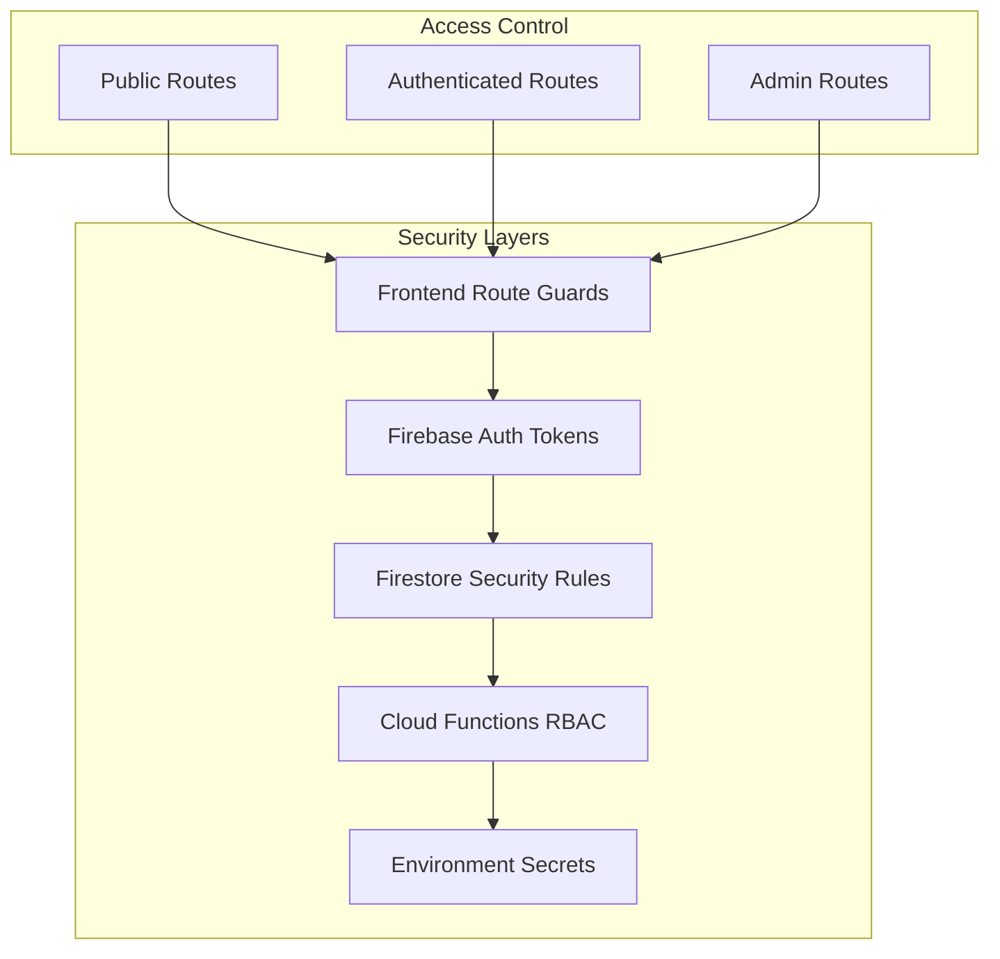

# Architecture & System Design

This document provides a high-level overview of the system architecture, data flow, and design decisions for LinkedGoals MVP.

## High-level System Architecture

LinkedGoals is a modern web application built with React and Firebase, focusing on goal management with LinkedIn integration and administrative capabilities.


### Architecture Principles

- **Serverless-first**: Leveraging Firebase's serverless infrastructure for scalability
- **Security by design**: Role-based access control with Firebase Auth and Firestore rules
- **Real-time capabilities**: Firestore's real-time updates for collaborative features
- **Type safety**: Full TypeScript implementation across frontend and backend
- **Mobile-responsive**: Progressive web app capabilities

## Data Flow Diagrams

### User Authentication Flow


### Goal Management Data Flow

```mermaid
flowchart TD
    A[User Creates Goal] --> B[GoalInputPage Component]
    B --> C[Validate Goal Data]
    C --> D[Save to Firestore]
    D --> E[users/{userId}/goals/{goalId}]

    F[User Views Dashboard] --> G[Dashboard Component]
    G --> H[Query User Goals]
    H --> I[Real-time Firestore Listener]
    I --> J[Update UI with Goals]

    K[Admin Management] --> L[AdminDashboard]
    L --> M[Query All Goals<br/>Collection Group Query]
    M --> N[Display in Admin Interface]

    O[Goal Sharing] --> P[SocialSharePage]
    P --> Q[Generate Share URL]
    Q --> R[SharedGoalView Component]
```

## Database Schema

### Firestore Collections Structure


### Key Database Design Decisions

- **User-centric data model**: Goals are subcollections under users for natural security boundaries
- **Collection group queries**: Admin dashboard uses collection group queries to access all goals
- **Denormalized data**: User information is duplicated in goals for efficient querying
- **Composite indexes**: Custom indexes for complex queries (userId + createdAt for checkins)

## API Architecture

### RESTful Cloud Functions


### Authentication Flow

- **OAuth 2.0 + OpenID Connect**: LinkedIn integration using industry standards
- **Custom Firebase tokens**: Seamless integration with Firebase Auth
- **Role-based access**: Admin role checking for privileged operations

### API Endpoints

1. **`linkedinlogin` (HTTP Function)**

   - Method: POST
   - Purpose: Handle LinkedIn OAuth callback and user authentication
   - Security: CORS-enabled for app.linkedgoals.app

2. **`manageUser` (Callable Function)**

   - Purpose: Admin user management (enable/disable accounts)
   - Security: Admin role verification required

3. **`saveSmartGoal` (Callable Function)**
   - Purpose: Enhanced goal creation with SMART framework validation
   - Security: Authenticated users only

## Third-party Integrations

### LinkedIn Integration

- **Purpose**: User authentication and profile data
- **Implementation**: OAuth 2.0 with OpenID Connect
- **Scope**: `openid`, `profile`, `email`
- **Security**: Client secret managed via Firebase Functions secrets

### Firebase Services

- **Authentication**: User management and security
- **Firestore**: Real-time NoSQL database
- **Functions**: Serverless backend logic
- **Hosting**: Static site hosting with CDN
- **Security Rules**: Database-level access control

## Security Architecture

### Multi-layered Security Model



### Security Features

- **Route-based protection**: AdminProtectedRoute component for admin-only pages
- **Token-based authentication**: Firebase custom tokens with automatic refresh
- **Database security rules**: Firestore rules enforce user-level and admin-level access
- **Secret management**: LinkedIn client secret managed via Firebase Functions parameters
- **CORS protection**: Strict CORS policy for Cloud Functions

## System Boundaries and Communication

### Frontend Architecture


### Communication Patterns

- **Real-time updates**: Firestore listeners for live data synchronization
- **Optimistic updates**: Frontend updates UI immediately, syncs with backend
- **Error boundaries**: Comprehensive error handling and user feedback
- **Loading states**: Progressive loading with skeleton screens

## Performance and Scalability

### Caching Strategy

- **Browser caching**: Static assets cached via Firebase Hosting CDN
- **Firestore offline**: Built-in offline support with automatic sync
- **Component memoization**: React.memo and useMemo for expensive computations
- **Bundle splitting**: Vite-based code splitting for optimal loading

### Scalability Considerations

- **Serverless functions**: Auto-scaling Cloud Functions
- **NoSQL database**: Horizontal scaling capabilities of Firestore
- **CDN distribution**: Global content delivery via Firebase Hosting
- **Efficient queries**: Optimized Firestore queries with proper indexing
