# External Integrations

This document describes all external services and integrations used by the LinkedGoals MVP application, including detailed setup instructions, API specifications, and troubleshooting guidance.

## Table of Contents

- [LinkedIn Integration](#linkedin-integration)
- [Firebase Services](#firebase-services)
- [Authentication & Security](#authentication--security)
- [External APIs & Services](#external-apis--services)
- [Webhooks & Real-time Data](#webhooks--real-time-data)
- [Rate Limiting & Performance](#rate-limiting--performance)
- [Monitoring & Analytics](#monitoring--analytics)
- [Configuration Management](#configuration-management)
- [Troubleshooting](#troubleshooting)

## LinkedIn Integration

### Overview

The application integrates with LinkedIn using **OAuth 2.0 with OpenID Connect** to provide user authentication and profile access through LinkedIn's **OpenID Connect userinfo endpoint**.

✅ **Current Working Implementation**: Uses OpenID Connect with `openid profile email` scopes and `/v2/userinfo` endpoint.

### LinkedIn OpenID Connect Configuration

#### Required LinkedIn Developer App Settings

1. **Products Required**:

   - ✅ "Sign In with LinkedIn using OpenID Connect"

2. **OAuth 2.0 Scopes (OpenID Connect)**:

   - ✅ `openid` - Required for OpenID Connect
   - ✅ `profile` - Access to basic profile information
   - ✅ `email` - Access to email address

3. **Authorized Redirect URLs**:
   - **Production**: `https://app.linkedgoals.app/linkedin`
   - **Staging**: `https://linkedgoals-staging.web.app/linkedin`
   - **Development**: `https://linkedgoals-development.web.app/linkedin`
   - **Local Development**: `http://localhost:5173/linkedin`

#### API Endpoints Used

```typescript
// LinkedIn OpenID Connect Endpoints (Working Implementation)
const LINKEDIN_ENDPOINTS = {
  // OAuth token exchange
  TOKEN_URL: "https://www.linkedin.com/oauth/v2/accessToken",

  // OpenID Connect userinfo endpoint
  USERINFO_URL: "https://api.linkedin.com/v2/userinfo",

  // Authorization URL
  AUTH_URL: "https://www.linkedin.com/oauth/v2/authorization",
};
```

### Implementation Details

#### Frontend OAuth Flow (OpenID Connect)

```typescript
// src/components/LinkedInLogin.tsx
const initiateLinkedInAuth = () => {
  // Generate state for security
  const state = Math.random().toString(36).substring(7);
  sessionStorage.setItem("linkedin_oauth_state", state);

  // Build OAuth URL with OpenID Connect scopes
  const params = new URLSearchParams({
    response_type: "code",
    client_id: import.meta.env.VITE_LINKEDIN_CLIENT_ID,
    redirect_uri: import.meta.env.VITE_LINKEDIN_REDIRECT_URI,
    scope: "openid profile email", // OpenID Connect scopes
    state: state,
  });

  const authUrl = `https://www.linkedin.com/oauth/v2/authorization?${params}`;
  window.location.href = authUrl;
};
```

#### Backend Token Exchange (OpenID Connect)

```typescript
// functions/src/index.ts - linkedinlogin function
export const linkedinlogin = onRequest(async (req, res) => {
  const { code, state } = req.body;

  // Standard OAuth token exchange
  const tokenRequestParams = {
    grant_type: "authorization_code",
    code: code,
    redirect_uri: process.env.LINKEDIN_REDIRECT_URI,
    client_id: process.env.LINKEDIN_CLIENT_ID,
    client_secret: process.env.LINKEDIN_CLIENT_SECRET,
  };

  try {
    // Exchange code for access token
    const tokenResponse = await axios.post(
      "https://www.linkedin.com/oauth/v2/accessToken",
      new URLSearchParams(tokenRequestParams),
      {
        headers: { "Content-Type": "application/x-www-form-urlencoded" },
      }
    );

    const { access_token } = tokenResponse.data;

    // Fetch user info using OpenID Connect userinfo endpoint
    const userInfoResponse = await axios.get(
      "https://api.linkedin.com/v2/userinfo",
      {
        headers: { Authorization: `Bearer ${access_token}` },
      }
    );

    const userInfo = userInfoResponse.data;

    // Create/update Firebase user and return custom token
    const customToken = await createFirebaseUser(userInfo);

    res.status(200).json({
      success: true,
      customToken,
      user: userInfo,
    });
  } catch (error) {
    logger.error("LinkedIn OAuth failed:", error);
    res.status(500).json({ error: "Authentication failed" });
  }
});
```

### Multi-Environment Setup

#### Environment Detection

The application automatically detects the environment and configures LinkedIn OAuth accordingly:

```typescript
// Dynamic redirect URI based on current hostname
const getRedirectUri = () => {
  if (typeof window !== "undefined") {
    const hostname = window.location.hostname;
    const protocol = window.location.protocol;
    
    // Environment-specific redirect URIs
    if (hostname.includes('linkedgoals-development') || hostname.includes('development')) {
      return `${protocol}//${hostname}/linkedin`;
    }
    if (hostname.includes('linkedgoals-staging') || hostname.includes('staging')) {
      return `${protocol}//${hostname}/linkedin`;
    }
    if (hostname === 'localhost' || hostname === '127.0.0.1') {
      return `${protocol}//${hostname}:${window.location.port}/linkedin`;
    }
    // Production fallback
    return "https://app.linkedgoals.app/linkedin";
  }
  
  return "https://app.linkedgoals.app/linkedin";
};
```

#### Backend Environment Handling

```typescript
// Environment-specific redirect URI detection in Cloud Functions
const origin = req.get('origin') || req.get('referer') || '';
let redirectUri = "https://app.linkedgoals.app/linkedin"; // Default to production

if (origin.includes('linkedgoals-staging.web.app')) {
  redirectUri = "https://linkedgoals-staging.web.app/linkedin";
} else if (origin.includes('linkedgoals-development.web.app')) {
  redirectUri = "https://linkedgoals-development.web.app/linkedin";
} else if (origin.includes('localhost')) {
  redirectUri = "http://localhost:5173/linkedin";
}
```

### Environment Configuration

#### Required Environment Variables

```bash
# Frontend (.env)
VITE_LINKEDIN_CLIENT_ID=7880c93kzzfsgj
VITE_LINKEDIN_REDIRECT_URI=https://app.linkedgoals.app/linkedin

# Backend (Firebase Functions Secrets)
LINKEDIN_CLIENT_ID=7880c93kzzfsgj
LINKEDIN_CLIENT_SECRET=your_secret_here
LINKEDIN_REDIRECT_URI=https://app.linkedgoals.app/linkedin
```

#### Setting Up Secrets

```bash
# Set Firebase Function secrets
firebase functions:secrets:set LINKEDIN_CLIENT_SECRET
firebase functions:secrets:set LINKEDIN_CLIENT_ID
firebase functions:secrets:set LINKEDIN_REDIRECT_URI

# Deploy functions with secrets
firebase deploy --only functions
```

### LinkedIn Integration Troubleshooting

#### Common Issues & Solutions

1. **Staging redirects to production after login**

   - ✅ **Fixed**: Updated LinkedInCallback.tsx to use environment-aware function URLs
   - ✅ **Fixed**: Backend detects origin and uses correct redirect URI

2. **"OpenID permission is not supported for PKCE flows"**

   - ✅ **Working**: Use `openid profile email` scopes with standard OAuth (not PKCE)
   - ✅ **Working**: Use OpenID Connect userinfo endpoint

3. **"invalid_client" errors**

   - Check client ID/secret configuration
   - Ensure redirect URI matches exactly in LinkedIn app settings

4. **CORS errors**
   - ✅ **Fixed**: Production function configured with staging CORS origins

#### Debug Information

```typescript
// Successful authentication logs
console.log("✅ LinkedIn config loaded successfully");
console.log("🔄 Exchanging code for access token...");
console.log("✅ Token exchange successful");
console.log("👤 Fetching LinkedIn userinfo via OpenID Connect...");
console.log("✅ OpenID Connect userinfo fetched successfully");
console.log("🔥 Creating/updating Firebase user...");
console.log("✅ Custom token created successfully");
```

## Firebase Services

### Core Firebase Integrations

#### 1. Firebase Authentication

```typescript
// Authentication configuration
import { getAuth, signInWithCustomToken } from "firebase/auth";
import { auth } from "../lib/firebase";

// Custom token authentication (from LinkedIn OAuth)
const signInWithLinkedIn = async (customToken: string) => {
  try {
    const userCredential = await signInWithCustomToken(auth, customToken);
    return userCredential.user;
  } catch (error) {
    console.error("Firebase sign-in failed:", error);
    throw error;
  }
};
```

#### 2. Cloud Firestore

```typescript
// Database operations
import {
  getFirestore,
  collection,
  doc,
  addDoc,
  updateDoc,
  deleteDoc,
  query,
  where,
  orderBy,
  limit,
} from "firebase/firestore";

const db = getFirestore();

// Goal management operations
export const createGoal = async (goalData: Goal) => {
  const goalRef = collection(db, `users/${userId}/goals`);
  const docRef = await addDoc(goalRef, {
    ...goalData,
    createdAt: new Date(),
    updatedAt: new Date(),
  });
  return docRef.id;
};
```

#### 3. Cloud Functions

The application uses three main Cloud Functions:

**a) linkedinlogin (HTTP Function)**

```typescript
// Authentication endpoint
URL: https://us-central1-linkedgoals-d7053.cloudfunctions.net/linkedinlogin
Method: POST
Purpose: Handle LinkedIn OAuth callback
CORS: Enabled for app.linkedgoals.app
```

**b) manageUser (Callable Function)**

```typescript
// Admin user management
import { getFunctions, httpsCallable } from "firebase/functions";

const functions = getFunctions();
const manageUser = httpsCallable(functions, "manageUser");

// Usage
const result = await manageUser({
  uid: "user-id",
  action: "disable" | "enable" | "delete",
});
```

**c) saveSmartGoal (HTTP Function)**

```typescript
// Enhanced goal creation
URL: https://us-central1-linkedgoals-d7053.cloudfunctions.net/saveSmartGoal
Method: POST
Purpose: SMART goal validation and enhancement
```

#### 4. Firebase Hosting

```json
// firebase.json hosting configuration
{
  "hosting": {
    "public": "dist",
    "ignore": ["firebase.json", "**/.*", "**/node_modules/**"],
    "rewrites": [{ "source": "**", "destination": "/index.html" }],
    "headers": [
      {
        "source": "**/*.@(js|css|svg|jpg|jpeg|png|gif|ico|json)",
        "headers": [{ "key": "Cache-Control", "value": "max-age=31536000" }]
      }
    ]
  }
}
```

### Firebase Security Rules

#### Firestore Security Rules

```javascript
// firestore.rules
rules_version = '2';
service cloud.firestore {
  match /databases/{database}/documents {

    function isAdmin() {
      return get(/databases/$(database)/documents/users/$(request.auth.uid)).data.role == 'admin';
    }

    // User data access
    match /users/{userId} {
      allow read, write: if request.auth != null &&
        (request.auth.uid == userId || isAdmin());

      // User subcollections (goals, checkins)
      match /{document=**} {
        allow read, write: if request.auth != null &&
          (request.auth.uid == userId || isAdmin());
      }
    }

    // Admin access to all goals
    match /goals/{goalId} {
      allow read, write: if request.auth != null && isAdmin();
    }
  }
}
```

#### Storage Security Rules

```javascript
// storage.rules
rules_version = '2';
service firebase.storage {
  match /b/{bucket}/o {
    match /users/{userId}/{allPaths=**} {
      allow read, write: if request.auth != null &&
        request.auth.uid == userId;
    }
  }
}
```

## Authentication & Security

### Multi-layered Authentication Flow

```mermaid
graph LR
    A[User] --> B[LinkedIn OAuth]
    B --> C[Authorization Code]
    C --> D[Firebase Function]
    D --> E[LinkedIn API v2]
    E --> F[User Profile + Email]
    F --> G[Firebase User Creation]
    G --> H[Custom Token]
    H --> I[Frontend Authentication]
    I --> J[Authenticated Session]
```



### Token Management

#### Access Token Lifecycle

```typescript
// Token management in Cloud Functions
const exchangeCodeForToken = async (code: string) => {
  const tokenResponse = await axios.post(
    "https://www.linkedin.com/oauth/v2/accessToken",
    tokenRequestParams,
    {
      headers: { "Content-Type": "application/x-www-form-urlencoded" },
      timeout: 10000, // 10 second timeout
    }
  );

  return {
    access_token: tokenResponse.data.access_token,
    expires_in: tokenResponse.data.expires_in,
    token_type: tokenResponse.data.token_type,
  };
};
```

#### Firebase Custom Tokens

```typescript
// Custom token creation with claims
const createCustomTokenWithClaims = async (uid: string, claims = {}) => {
  const additionalClaims = {
    provider: "linkedin",
    loginTime: Date.now(),
    ...claims,
  };

  return await admin.auth().createCustomToken(uid, additionalClaims);
};
```

### Security Headers & CORS

#### CORS Configuration

```typescript
// Cloud Function CORS setup
export const linkedinlogin = onRequest(async (req, res) => {
  // CORS headers
  res.set("Access-Control-Allow-Origin", "https://app.linkedgoals.app");
  res.set("Access-Control-Allow-Methods", "POST, OPTIONS");
  res.set("Access-Control-Allow-Headers", "Content-Type, Authorization");
  res.set("Access-Control-Allow-Credentials", "true");

  if (req.method === "OPTIONS") {
    res.status(204).send("");
    return;
  }

  // Function logic...
});
```

#### Security Headers (Frontend)

```json
// firebase.json security headers
{
  "headers": [
    {
      "source": "**",
      "headers": [
        { "key": "X-Content-Type-Options", "value": "nosniff" },
        { "key": "X-Frame-Options", "value": "DENY" },
        { "key": "X-XSS-Protection", "value": "1; mode=block" },
        {
          "key": "Strict-Transport-Security",
          "value": "max-age=31536000; includeSubDomains"
        },
        {
          "key": "Content-Security-Policy",
          "value": "default-src 'self'; script-src 'self' 'unsafe-inline'"
        }
      ]
    }
  ]
}
```

## External APIs & Services

### Third-party Service Integrations

#### 1. Performance Monitoring

```typescript
// Firebase Performance Monitoring
import { getPerformance, trace } from "firebase/performance";

const perf = getPerformance();

// Track custom operations
const trackGoalCreation = () => {
  const goalTrace = trace(perf, "goal_creation_flow");
  goalTrace.start();

  // Goal creation logic

  goalTrace.stop();
};
```

#### 2. Error Tracking & Logging

```typescript
// Structured error logging
const logError = (error: Error, context: any) => {
  const errorInfo = {
    message: error.message,
    stack: error.stack,
    context: context,
    timestamp: new Date().toISOString(),
    userAgent: navigator.userAgent,
    url: window.location.href,
  };

  console.error("Application Error:", JSON.stringify(errorInfo));

  // Send to external monitoring service (if configured)
  // sendToSentry(errorInfo);
  // sendToDatadog(errorInfo);
};
```

#### 3. Analytics Integration (Planned)

```typescript
// Google Analytics 4 setup
interface AnalyticsEvent {
  action: string;
  category: string;
  label?: string;
  value?: number;
}

const trackEvent = (event: AnalyticsEvent) => {
  if (typeof gtag !== "undefined") {
    gtag("event", event.action, {
      event_category: event.category,
      event_label: event.label,
      value: event.value,
    });
  }
};

// Usage examples
trackEvent({
  action: "goal_created",
  category: "engagement",
  label: "professional_goal",
});
```

### API Rate Limiting Strategy

#### LinkedIn API Limits

- **Profile API**: 500 requests per user per day
- **Email API**: 500 requests per user per day
- **OAuth Token**: No specific limit, but use standard retry logic

#### Implementation

```typescript
// Rate limiting with exponential backoff
const makeLinkedInRequest = async (url: string, options: any, retries = 3) => {
  try {
    const response = await axios(url, options);
    return response.data;
  } catch (error: any) {
    if (error.response?.status === 429 && retries > 0) {
      const delay = Math.pow(2, 3 - retries) * 1000; // Exponential backoff
      console.log(`Rate limited, retrying in ${delay}ms...`);

      await new Promise((resolve) => setTimeout(resolve, delay));
      return makeLinkedInRequest(url, options, retries - 1);
    }
    throw error;
  }
};
```

## Webhooks & Real-time Data

### Firebase Real-time Updates

#### Firestore Real-time Listeners

```typescript
// Real-time goal updates
import { onSnapshot, collection, query, where } from "firebase/firestore";

const subscribeToUserGoals = (
  userId: string,
  callback: (goals: Goal[]) => void
) => {
  const goalsRef = collection(db, `users/${userId}/goals`);
  const q = query(goalsRef, where("isActive", "==", true));

  return onSnapshot(
    q,
    (snapshot) => {
      const goals = snapshot.docs.map((doc) => ({
        id: doc.id,
        ...doc.data(),
      })) as Goal[];

      callback(goals);
    },
    (error) => {
      console.error("Goals subscription error:", error);
    }
  );
};
```

#### Cloud Function Triggers

```typescript
// Firestore triggered functions
import {
  onDocumentCreated,
  onDocumentUpdated,
} from "firebase-functions/v2/firestore";

export const onGoalCreated = onDocumentCreated(
  "users/{userId}/goals/{goalId}",
  async (event) => {
    const goalData = event.data?.data();
    const { userId, goalId } = event.params;

    // Send notification, update analytics, etc.
    logger.info("New goal created", {
      userId,
      goalId,
      category: goalData?.category,
    });
  }
);

export const onGoalUpdated = onDocumentUpdated(
  "users/{userId}/goals/{goalId}",
  async (event) => {
    const before = event.data?.before.data();
    const after = event.data?.after.data();

    // Track progress changes
    if (before?.progress !== after?.progress) {
      logger.info("Goal progress updated", {
        goalId: event.params.goalId,
        oldProgress: before?.progress,
        newProgress: after?.progress,
      });
    }
  }
);
```

### Webhook Endpoints (Future Implementation)

#### External Webhook Handler

```typescript
// Generic webhook handler template
export const webhookHandler = onRequest(async (req, res) => {
  // Verify webhook signature
  const signature = req.headers["x-webhook-signature"];
  const payload = JSON.stringify(req.body);

  if (!verifyWebhookSignature(payload, signature)) {
    res.status(401).json({ error: "Invalid signature" });
    return;
  }

  const { type, data } = req.body;

  try {
    switch (type) {
      case "user.updated":
        await handleUserUpdate(data);
        break;
      case "goal.completed":
        await handleGoalCompletion(data);
        break;
      default:
        logger.warn("Unknown webhook type:", type);
    }

    res.status(200).json({ received: true });
  } catch (error) {
    logger.error("Webhook processing failed:", error);
    res.status(500).json({ error: "Processing failed" });
  }
});
```

## Rate Limiting & Performance

### API Rate Limiting Implementation

#### Client-side Rate Limiting

```typescript
class RateLimiter {
  private requests: number[] = [];
  private maxRequests: number;
  private windowMs: number;

  constructor(maxRequests: number, windowMs: number) {
    this.maxRequests = maxRequests;
    this.windowMs = windowMs;
  }

  canMakeRequest(): boolean {
    const now = Date.now();
    this.requests = this.requests.filter((time) => now - time < this.windowMs);

    if (this.requests.length < this.maxRequests) {
      this.requests.push(now);
      return true;
    }

    return false;
  }

  getResetTime(): number {
    if (this.requests.length === 0) return 0;
    return this.requests[0] + this.windowMs;
  }
}

// Usage
const apiLimiter = new RateLimiter(100, 60000); // 100 requests per minute

const makeApiCall = async () => {
  if (!apiLimiter.canMakeRequest()) {
    const resetTime = apiLimiter.getResetTime();
    throw new Error(`Rate limit exceeded. Reset at ${new Date(resetTime)}`);
  }

  // Make API call
};
```

#### Server-side Rate Limiting

```typescript
// Cloud Function rate limiting
import { RateLimiterFirestore } from "rate-limiter-flexible";

const rateLimiter = new RateLimiterFirestore({
  storeClient: admin.firestore(),
  keyPrefix: "api_rate_limit",
  points: 100, // Requests
  duration: 60, // Per 60 seconds
});

export const rateLimitedFunction = onRequest(async (req, res) => {
  const key = req.ip || "anonymous";

  try {
    await rateLimiter.consume(key);

    // Process request
    res.status(200).json({ success: true });
  } catch (rejRes: any) {
    const msBeforeNext = rejRes.msBeforeNext || 60000;

    res.set("Retry-After", Math.round(msBeforeNext / 1000).toString());
    res.status(429).json({
      error: "Too Many Requests",
      retryAfter: msBeforeNext,
    });
  }
});
```

### Performance Optimization

#### Connection Pooling

```typescript
// Firebase connection optimization
import { initializeApp, getApps } from "firebase/app";

let app: any;

export const getFirebaseApp = () => {
  if (!app && getApps().length === 0) {
    app = initializeApp(firebaseConfig);
  }
  return app || getApps()[0];
};

// Reuse connections
const db = getFirestore(getFirebaseApp());
const auth = getAuth(getFirebaseApp());
```

#### Caching Strategy

```typescript
// In-memory caching for frequently accessed data
class CacheManager {
  private cache = new Map<string, { data: any; expiry: number }>();
  private defaultTTL = 5 * 60 * 1000; // 5 minutes

  set(key: string, data: any, ttl = this.defaultTTL) {
    this.cache.set(key, {
      data,
      expiry: Date.now() + ttl,
    });
  }

  get(key: string) {
    const item = this.cache.get(key);

    if (!item) return null;

    if (Date.now() > item.expiry) {
      this.cache.delete(key);
      return null;
    }

    return item.data;
  }

  clear() {
    this.cache.clear();
  }
}

const cache = new CacheManager();

// Usage in API calls
const getCachedUserData = async (userId: string) => {
  const cacheKey = `user:${userId}`;
  let userData = cache.get(cacheKey);

  if (!userData) {
    userData = await fetchUserData(userId);
    cache.set(cacheKey, userData);
  }

  return userData;
};
```

## Monitoring & Analytics

### Application Performance Monitoring

#### Firebase Performance Monitoring

```typescript
// Custom performance traces
import { getPerformance, trace } from "firebase/performance";

const perf = getPerformance();

export const trackPerformance = {
  startTrace: (name: string) => {
    const customTrace = trace(perf, name);
    customTrace.start();
    return customTrace;
  },

  stopTrace: (customTrace: any) => {
    customTrace.stop();
  },

  trackFunction: async <T>(name: string, fn: () => Promise<T>): Promise<T> => {
    const customTrace = trace(perf, name);
    customTrace.start();

    try {
      const result = await fn();
      customTrace.putAttribute("success", "true");
      return result;
    } catch (error) {
      customTrace.putAttribute("success", "false");
      customTrace.putAttribute("error", (error as Error).message);
      throw error;
    } finally {
      customTrace.stop();
    }
  },
};

// Usage examples
const createGoalWithTracking = async (goalData: Goal) => {
  return trackPerformance.trackFunction("goal_creation", async () => {
    return await createGoal(goalData);
  });
};
```

#### Health Check Endpoints

```typescript
// Health check function
export const healthCheck = onRequest(async (req, res) => {
  const health = {
    status: "healthy",
    timestamp: new Date().toISOString(),
    version: process.env.FUNCTION_VERSION || "unknown",
    services: {} as any,
  };

  try {
    // Check Firestore connectivity
    const db = admin.firestore();
    await db.doc("health/check").get();
    health.services.firestore = "connected";
  } catch (error) {
    health.services.firestore = "error";
    health.status = "degraded";
  }

  try {
    // Check Auth service
    await admin.auth().listUsers(1);
    health.services.auth = "connected";
  } catch (error) {
    health.services.auth = "error";
    health.status = "degraded";
  }

  const statusCode = health.status === "healthy" ? 200 : 503;
  res.status(statusCode).json(health);
});
```

### Error Monitoring & Alerting

#### Structured Error Reporting

```typescript
// Error reporting utility
interface ErrorReport {
  message: string;
  stack?: string;
  user?: string;
  url?: string;
  userAgent?: string;
  timestamp: string;
  severity: "low" | "medium" | "high" | "critical";
  context?: any;
}

export const reportError = (
  error: Error,
  context: any = {},
  severity: ErrorReport["severity"] = "medium"
) => {
  const report: ErrorReport = {
    message: error.message,
    stack: error.stack,
    user: context.userId,
    url: context.url || window?.location?.href,
    userAgent: context.userAgent || navigator?.userAgent,
    timestamp: new Date().toISOString(),
    severity,
    context,
  };

  // Log to console
  console.error("Error Report:", report);

  // Send to external monitoring (implement as needed)
  // sendToSentry(report);
  // sendToDatadog(report);

  // Store in Firestore for analysis
  if (severity === "high" || severity === "critical") {
    admin.firestore().collection("errors").add(report);
  }
};
```

## Configuration Management

### Environment-based Configuration

#### Configuration Structure

```typescript
// config/index.ts
interface AppConfig {
  app: {
    name: string;
    version: string;
    environment: "development" | "staging" | "production";
  };
  firebase: {
    projectId: string;
    authDomain: string;
    databaseURL: string;
    storageBucket: string;
  };
  linkedin: {
    clientId: string;
    redirectUri: string;
    scopes: string[];
  };
  features: {
    enableAnalytics: boolean;
    enablePerformanceMonitoring: boolean;
    enableOfflineSupport: boolean;
  };
  limits: {
    maxGoalsPerUser: number;
    maxCheckinsPerDay: number;
    apiTimeout: number;
  };
}

const config: AppConfig = {
  app: {
    name: "LinkedGoals MVP",
    version: process.env.npm_package_version || "1.0.0",
    environment: (process.env.NODE_ENV as any) || "development",
  },
  firebase: {
    projectId: process.env.VITE_FIREBASE_PROJECT_ID || "",
    authDomain: process.env.VITE_FIREBASE_AUTH_DOMAIN || "",
    databaseURL: process.env.VITE_FIREBASE_DATABASE_URL || "",
    storageBucket: process.env.VITE_FIREBASE_STORAGE_BUCKET || "",
  },
  linkedin: {
    clientId: process.env.VITE_LINKEDIN_CLIENT_ID || "",
    redirectUri: process.env.VITE_LINKEDIN_REDIRECT_URI || "",
    scopes: ["profile", "email"], // LinkedIn v2 scopes
  },
  features: {
    enableAnalytics: process.env.NODE_ENV === "production",
    enablePerformanceMonitoring: true,
    enableOfflineSupport: false,
  },
  limits: {
    maxGoalsPerUser: 50,
    maxCheckinsPerDay: 10,
    apiTimeout: 10000,
  },
};

export default config;
```

#### Secret Management

```bash
# Firebase Functions secrets management
firebase functions:secrets:set LINKEDIN_CLIENT_SECRET
firebase functions:secrets:set DATABASE_ENCRYPTION_KEY
firebase functions:secrets:set EXTERNAL_API_KEY

# List all secrets
firebase functions:secrets:list

# Access secrets in functions
export const secretFunction = onRequest(async (req, res) => {
  const clientSecret = defineSecret("LINKEDIN_CLIENT_SECRET");

  // Use secret value
  const secretValue = clientSecret.value();
});
```

### Feature Flags

#### Feature Flag Implementation

```typescript
// Feature flag management
class FeatureFlags {
  private flags: Map<string, boolean> = new Map();

  constructor() {
    this.loadFlags();
  }

  private loadFlags() {
    // Load from environment variables
    this.flags.set(
      "enable_new_dashboard",
      process.env.FEATURE_NEW_DASHBOARD === "true"
    );
    this.flags.set(
      "enable_social_sharing",
      process.env.FEATURE_SOCIAL_SHARING === "true"
    );
    this.flags.set(
      "enable_advanced_analytics",
      process.env.FEATURE_ADVANCED_ANALYTICS === "true"
    );
  }

  isEnabled(flag: string): boolean {
    return this.flags.get(flag) || false;
  }

  setFlag(flag: string, enabled: boolean) {
    this.flags.set(flag, enabled);
  }
}

export const featureFlags = new FeatureFlags();

// Usage in components
const Dashboard = () => {
  const showNewDashboard = featureFlags.isEnabled("enable_new_dashboard");

  return <div>{showNewDashboard ? <NewDashboard /> : <OldDashboard />}</div>;
};
```

## Troubleshooting

### Common Integration Issues

#### LinkedIn OAuth Troubleshooting

**1. "OpenID permission is not supported for PKCE flows"**

```bash
Solution: ✅ FIXED
- Use scopes: "profile email" (NOT "openid profile email")
- Remove all PKCE implementation
- Use standard OAuth 2.0 flow
```

**2. "invalid_client" errors**

```bash
Solution: ✅ FIXED
- Verify client ID/secret configuration
- Ensure no PKCE parameters in token request
- Check Firebase Function secrets are set correctly
```

**3. Token exchange failures**

```typescript
// Debug token exchange
const debugTokenExchange = async (code: string) => {
  console.log("🔍 Debug: Token exchange starting");
  console.log("Code length:", code.length);
  console.log(
    "Client ID:",
    process.env.LINKEDIN_CLIENT_ID?.substring(0, 8) + "..."
  );
  console.log("Redirect URI:", process.env.LINKEDIN_REDIRECT_URI);

  const params = {
    grant_type: "authorization_code",
    code: code,
    redirect_uri: process.env.LINKEDIN_REDIRECT_URI,
    client_id: process.env.LINKEDIN_CLIENT_ID,
    client_secret: process.env.LINKEDIN_CLIENT_SECRET,
  };

  console.log("🔍 Request params (secrets hidden):", {
    ...params,
    client_secret: "***hidden***",
  });

  try {
    const response = await axios.post(
      "https://www.linkedin.com/oauth/v2/accessToken",
      new URLSearchParams(params)
    );
    console.log("✅ Token exchange successful");
    return response.data;
  } catch (error: any) {
    console.error("❌ Token exchange failed:", {
      status: error.response?.status,
      data: error.response?.data,
    });
    throw error;
  }
};
```

#### Firebase Integration Issues

**1. CORS errors**

```typescript
// Proper CORS setup
export const corsEnabledFunction = onRequest(async (req, res) => {
  // Set CORS headers before any other logic
  res.set("Access-Control-Allow-Origin", "https://app.linkedgoals.app");
  res.set("Access-Control-Allow-Methods", "GET, POST, OPTIONS");
  res.set("Access-Control-Allow-Headers", "Content-Type, Authorization");

  if (req.method === "OPTIONS") {
    res.status(204).send("");
    return;
  }

  // Function logic here...
});
```

**2. Authentication token issues**

```typescript
// Debug custom token creation
const createCustomTokenWithDebug = async (uid: string) => {
  try {
    console.log("Creating custom token for UID:", uid);

    const customToken = await admin.auth().createCustomToken(uid);
    console.log("✅ Custom token created successfully");

    return customToken;
  } catch (error: any) {
    console.error("❌ Custom token creation failed:", {
      error: error.message,
      code: error.code,
      uid: uid,
    });
    throw error;
  }
};
```

**3. Firestore permission issues**

```bash
# Test Firestore rules
firebase firestore:rules:test --test-suite=test-rules.json

# Debug rules in console
rules_version = '2';
service cloud.firestore {
  match /databases/{database}/documents {
    match /{document=**} {
      allow read, write: if true; // Temporary for debugging
    }
  }
}
```

### Performance Troubleshooting

#### Slow API Responses

```typescript
// Add timing to functions
export const timedFunction = onRequest(async (req, res) => {
  const startTime = Date.now();

  try {
    // Function logic
    const result = await performOperation();

    const duration = Date.now() - startTime;
    console.log(`✅ Function completed in ${duration}ms`);

    res.status(200).json({
      success: true,
      data: result,
      timing: { duration },
    });
  } catch (error) {
    const duration = Date.now() - startTime;
    console.error(`❌ Function failed after ${duration}ms:`, error);

    res.status(500).json({
      error: "Internal server error",
      timing: { duration },
    });
  }
});
```

#### Memory Usage Issues

```typescript
// Monitor memory usage in Cloud Functions
const monitorMemory = () => {
  const used = process.memoryUsage();
  const usage = {
    rss: Math.round((used.rss / 1024 / 1024) * 100) / 100,
    heapTotal: Math.round((used.heapTotal / 1024 / 1024) * 100) / 100,
    heapUsed: Math.round((used.heapUsed / 1024 / 1024) * 100) / 100,
    external: Math.round((used.external / 1024 / 1024) * 100) / 100,
  };

  console.log("📊 Memory usage (MB):", usage);

  if (usage.heapUsed > 100) {
    console.warn("⚠️ High memory usage detected");
  }

  return usage;
};
```

### Debug Tools & Commands

#### Useful Debug Commands

```bash
# Firebase debugging
firebase functions:log --only linkedinlogin
firebase firestore:rules:test
firebase emulators:start --debug

# Network debugging
curl -X POST https://us-central1-linkedgoals-d7053.cloudfunctions.net/linkedinlogin \
  -H "Content-Type: application/json" \
  -d '{"code": "test", "state": "test"}'

# Environment debugging
firebase functions:config:get
firebase functions:secrets:list
```

#### Test Endpoints

```typescript
// Create test endpoints for debugging
export const debugEndpoint = onRequest(async (req, res) => {
  const debug = {
    timestamp: new Date().toISOString(),
    environment: process.env.NODE_ENV,
    nodeVersion: process.version,
    firebaseProjectId: admin.app().options.projectId,
    cors: req.headers.origin,
    userAgent: req.headers["user-agent"],
    secrets: {
      linkedinClientIdSet: !!process.env.LINKEDIN_CLIENT_ID,
      linkedinSecretSet: !!process.env.LINKEDIN_CLIENT_SECRET,
    },
  };

  res.status(200).json(debug);
});
```

---

This comprehensive integration documentation provides complete coverage of all external services, APIs, and configurations used in the LinkedGoals MVP application. Regular updates should be made to reflect changes in external service APIs, especially LinkedIn's API v2 requirements.
