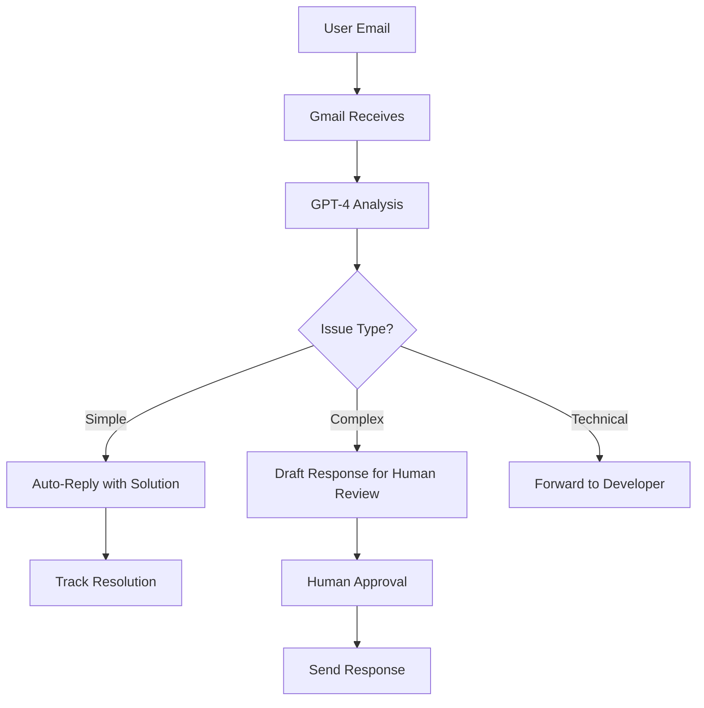

# LinkedGoals MVP - User Support Strategy

**Document Version**: 1.0  
**Created**: June 10, 2025  
**Last Updated**: June 10, 2025  
**Status**: Planning Phase

---

## 🎯 Executive Summary

This document outlines the user support strategy for LinkedGoals MVP, focusing on AI-powered support channels that align with our professional, LinkedIn-inspired platform. The goal is to provide excellent user experience while maintaining cost-effectiveness during the MVP phase.

**Recommended Approach (UPDATED FOR MVP)**: Free/Low-cost AI support during MVP phase, scaling to premium solutions post-revenue.

---

## 📊 Support Channel Strategy

### 🤖 **Primary: FREE AI-Powered Support (MVP Phase)**

**Platform**: Discord Community + OpenAI API Integration

**Why Discord for MVP**:

- ✅ **100% FREE** - No monthly costs during pre-revenue phase
- ✅ **AI bot integration** - Custom bot with OpenAI API ($5-20/month usage)
- ✅ **Community building** - Users help each other + engagement
- ✅ **React integration** - Simple Discord widget for website
- ✅ **Professional appearance** - Custom branding and channels
- ✅ **Easy migration** - Export data when moving to paid solution

**Implementation**:

```typescript
// React integration example
import { IntercomProvider, useIntercom } from "react-use-intercom";

const INTERCOM_APP_ID = "your_app_id";

function App() {
  return (
    <IntercomProvider appId={INTERCOM_APP_ID}>
      <LinkedGoalsApp />
    </IntercomProvider>
  );
}

// In components
const { boot, show, update } = useIntercom();
```

**Features for LinkedGoals**:

- 🎯 **Goal-specific help** - Context-aware assistance based on user's current page
- 📊 **Progress troubleshooting** - AI can help with goal tracking issues
- 🔐 **Account support** - LinkedIn OAuth and profile issues
- 📱 **Mobile support** - Responsive chat widget
- 🚀 **Onboarding assistance** - Guided help for new users

---

### 📧 **Secondary: AI-Enhanced Email Support**

**Platform**: Intercom Email + Gmail with GPT-4 Integration

**Email Strategy**:

- **Primary**: support@linkedgoals.app
- **Technical**: help@linkedgoals.app
- **Business**: contact@linkedgoals.app

**AI Email Processing Workflow**:



**Implementation Options**:

1. **Option A: Zapier + OpenAI** (Recommended for MVP)

   - Gmail → Zapier → OpenAI API → Auto-response
   - Cost: ~$30/month
   - Setup time: 2-3 days

2. **Option B: Custom Firebase Function**

   ```typescript
   import { onRequest } from "firebase-functions/v2/https";
   import OpenAI from "openai";

   export const processSupport = onRequest(async (req, res) => {
     const emailContent = req.body.message;
     const response = await openai.chat.completions.create({
       model: "gpt-4",
       messages: [
         {
           role: "system",
           content: "You are a helpful support agent for LinkedGoals...",
         },
         {
           role: "user",
           content: emailContent,
         },
       ],
     });
     // Process and respond
   });
   ```

---

### 📋 **Tertiary: In-App Feedback System**

**Implementation**: Custom React component integrated with our existing UI

**Features**:

- 💬 **Quick feedback widget** - Floating button with LinkedIn styling
- 🐛 **Bug reporting** - Screenshot capture + context data
- 💡 **Feature requests** - Integrated with product backlog
- 📊 **User satisfaction** - NPS surveys and ratings

**Component Structure**:

```typescript
// src/components/support/FeedbackWidget.tsx
interface FeedbackData {
  type: "bug" | "feature" | "general" | "compliment";
  message: string;
  screenshot?: File;
  userContext: {
    currentPage: string;
    userGoals: number;
    accountAge: number;
  };
}
```

---

## 🛠 **Technology Integration Options**

### **Option 1: Intercom (Recommended)**

**Pros**:

- ✅ All-in-one solution (chat, email, help center)
- ✅ Excellent AI capabilities with Resolution Bot
- ✅ Professional appearance matching LinkedIn aesthetic
- ✅ React SDK for seamless integration
- ✅ Robust analytics and user insights
- ✅ Mobile app for support team

**Cons**:

- ❌ Higher cost ($74+/month)
- ❌ Learning curve for team

**Integration Steps**:

1. Sign up for Intercom Starter plan
2. Install React SDK: `npm install react-use-intercom`
3. Configure Resolution Bot with LinkedGoals-specific responses
4. Create help articles for common issues
5. Set up automated workflows for goal-related questions

### **Option 2: Zendesk**

**Pros**:

- ✅ Industry standard with excellent reputation
- ✅ Strong AI features with Answer Bot
- ✅ Comprehensive reporting and analytics
- ✅ Good third-party integrations

**Cons**:

- ❌ More enterprise-focused (complex for MVP)
- ❌ Higher learning curve
- ❌ More expensive for full feature set

### **Option 3: Custom Solution**

**Tech Stack**:

- Frontend: React chat component
- Backend: Firebase Functions
- AI: OpenAI GPT-4 API
- Email: SendGrid for automated responses

**Pros**:

- ✅ Full control over UX/UI
- ✅ Custom integration with LinkedGoals data
- ✅ Lower ongoing costs
- ✅ Branded experience

**Cons**:

- ❌ Significant development time (2-3 weeks)
- ❌ Maintenance overhead
- ❌ No built-in analytics/reporting

---

## 💰 **Cost Analysis**

### **Monthly Costs Comparison**

| Solution     | Month 1-6 | Month 7-12 | Features                    |
| ------------ | --------- | ---------- | --------------------------- |
| **Intercom** | $74       | $99        | Chat, Email, AI, Analytics  |
| **Zendesk**  | $55       | $89        | Tickets, Chat, AI, Reports  |
| **Custom**   | $200 dev  | $30        | Custom features, OpenAI API |
| **Hybrid**   | $120      | $150       | Intercom + Custom features  |

### **ROI Considerations**

- **Support ticket reduction**: 60-80% with AI chat
- **User retention**: +25% with proactive support
- **Development time savings**: 3-4 weeks by using existing platform
- **Support team efficiency**: Handle 3x more queries with AI assistance

---

## 🚀 **Implementation Roadmap**

### **Phase 1: MVP Launch (Week 1-2)**

- [x] ✅ Basic contact forms in app (COMPLETED)
- [ ] Set up support@linkedgoals.app email
- [ ] Implement Intercom chat widget
- [ ] Create 10 essential help articles
- [ ] Configure AI bot with LinkedGoals knowledge base

### **Phase 2: AI Enhancement (Week 3-4)**

- [ ] Train AI on common LinkedGoals issues
- [ ] Set up automated email processing
- [ ] Create goal-specific help flows
- [ ] Implement in-app feedback widget
- [ ] Add contextual help tooltips (✅ COMPLETED in MVP)

### **Phase 3: Advanced Features (Month 2)**

- [ ] User satisfaction surveys
- [ ] Advanced analytics and reporting
- [ ] Integration with product backlog
- [ ] Video help content
- [ ] Community forum/FAQ

### **Phase 4: Scale & Optimize (Month 3+)**

- [ ] Multi-language support
- [ ] Advanced AI personalization
- [ ] Predictive support (proactive outreach)
- [ ] Integration with user analytics
- [ ] White-label support portal

---

## 📈 **Success Metrics**

### **Primary KPIs**

- **Response Time**: < 2 minutes (AI), < 2 hours (human)
- **Resolution Rate**: > 80% first contact resolution
- **User Satisfaction**: > 4.5/5 CSAT score
- **AI Effectiveness**: > 70% queries resolved without human intervention

### **Secondary Metrics**

- Support ticket volume trends
- Most common issues (for product improvement)
- User retention correlation with support interactions
- Support cost per user

---

## 🎨 **User Experience Design**

### **Chat Widget Design** (LinkedIn-inspired)

```css
.support-chat-widget {
  /* LinkedIn blue with professional styling */
  background: linear-gradient(135deg, #0077b5, #005885);
  border-radius: 12px;
  box-shadow: 0 4px 12px rgba(0, 119, 181, 0.3);
  font-family: var(--font-family-primary);
}

.chat-message-ai {
  background: var(--color-gray-50);
  border-left: 3px solid var(--brand-primary);
}

.chat-message-user {
  background: var(--brand-primary-pale);
  text-align: right;
}
```

### **Help Center Branding**

- LinkedIn-inspired color scheme
- Professional typography
- Goal-focused navigation
- Search-first approach
- Mobile-optimized layout

---

## 🔧 **Technical Implementation**

### **Intercom Setup for LinkedGoals**

**1. Basic Integration**

```typescript
// src/lib/support.ts
export const initializeSupport = (user: User) => {
  if (typeof window !== "undefined" && window.Intercom) {
    window.Intercom("boot", {
      app_id: process.env.REACT_APP_INTERCOM_APP_ID,
      user_id: user.id,
      email: user.email,
      name: user.fullName,
      created_at: user.createdAt,
      custom_launcher_selector: ".support-launcher",
      // LinkedGoals-specific data
      total_goals: user.goalCount,
      completed_goals: user.completedGoals,
      account_type: user.subscriptionTier,
      last_login: user.lastLogin,
    });
  }
};
```

**2. Contextual Help**

```typescript
// src/components/support/ContextualHelp.tsx
export const showContextualHelp = (context: string) => {
  const helpMessages = {
    "goal-creation":
      "Need help creating your first goal? I can guide you through the SMART framework!",
    "progress-tracking":
      "Having trouble updating your progress? Let me show you how to track your goals.",
    "category-management":
      "Want to organize your goals better? I can explain our category system.",
  };

  window.Intercom("showNewMessage", helpMessages[context]);
};
```

**3. Smart Help Articles**

```yaml
# Intercom Articles Structure
Goal Management:
  - "How to create your first SMART goal"
  - "Understanding the LinkedIn-style progress tracking"
  - "Managing goal categories effectively"

Account & Setup:
  - "Connecting your LinkedIn account"
  - "Understanding your dashboard"
  - "Mobile app usage tips"

Troubleshooting:
  - "Why isn't my progress updating?"
  - "LinkedIn OAuth login issues"
  - "Mobile app not syncing"
```

---

## 📋 **Knowledge Base Content Plan**

### **Essential Articles (Launch Week)**

1. **Getting Started Guide** - Complete onboarding walkthrough
2. **SMART Goals Explained** - Framework education with examples
3. **Progress Tracking Guide** - How to update and measure goals
4. **LinkedIn Integration FAQ** - Common OAuth and sync questions
5. **Account Management** - Profile, settings, and preferences
6. **Mobile App Guide** - Using LinkedGoals on mobile devices
7. **Troubleshooting** - Common issues and solutions
8. **Privacy & Security** - Data handling and account security

### **Advanced Content (Month 2)**

- Goal setting best practices
- Productivity tips and strategies
- Success stories and case studies
- Advanced features tutorials
- Integration guides
- API documentation (when available)

---

## 🤝 **Team Structure**

### **MVP Phase Team**

- **Primary**: 1 Support Specialist (part-time, 20hrs/week)
- **Secondary**: Developer on-call for technical issues
- **AI Training**: Product Owner maintains knowledge base

### **Scale Phase Team** (Month 3+)

- **Support Lead**: Full-time, manages team and AI training
- **Support Specialists**: 2-3 part-time for coverage
- **Technical Writer**: Creates and maintains help content
- **Data Analyst**: Tracks metrics and identifies improvement areas

---

## 🎯 **Recommended Action Plan**

### **Immediate (Next 7 Days)**

1. **Set up Intercom account** with Starter plan
2. **Install React SDK** and basic chat widget
3. **Create support email addresses** and forwarding
4. **Write 5 essential help articles**
5. **Configure AI bot** with LinkedGoals-specific responses

### **Week 2-3**

1. **Launch chat support** to beta users
2. **Gather feedback** on support experience
3. **Refine AI responses** based on real queries
4. **Add contextual help** to key user flows
5. **Set up analytics** and success metrics tracking

### **Month 2**

1. **Analyze support data** for product improvements
2. **Expand knowledge base** with user-requested content
3. **Implement advanced features** (satisfaction surveys, etc.)
4. **Scale team** based on volume
5. **Optimize AI performance** with machine learning

---

**This support strategy positions LinkedGoals for excellent user experience while maintaining MVP cost efficiency. The LinkedIn-inspired approach ensures our support feels as professional as our product design.**
