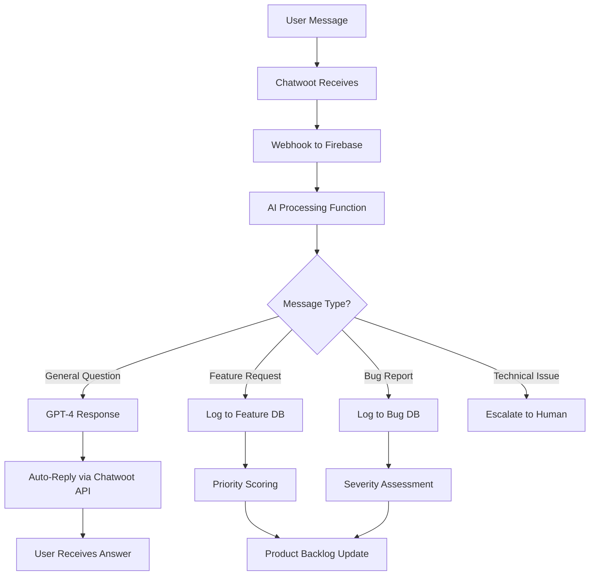

# Chatwoot AI Enhancement & Request Tracking System

**Document Version**: 1.0  
**Created**: June 10, 2025  
**Status**: Implementation Ready

---

## 🤖 **AI-Enhanced Chatwoot Integration**

### **Architecture Overview**



---

## 🔧 **Implementation: AI Response System**

### **1. Chatwoot Webhook Setup**

First, set up Chatwoot to send webhooks to your Firebase function:

```typescript
// src/lib/chatwoot-webhook.ts
import { onRequest } from "firebase-functions/v2/https";
import { initializeApp } from "firebase-admin/app";
import { getFirestore } from "firebase-admin/firestore";
import OpenAI from "openai";

if (!admin.apps.length) {
  initializeApp();
}

const db = getFirestore();
const openai = new OpenAI({
  apiKey: process.env.OPENAI_API_KEY,
});

export const chatwootWebhook = onRequest(async (req, res) => {
  const { event, data } = req.body;

  // Only process new messages from users
  if (event === "message_created" && data.message_type === "incoming") {
    await processUserMessage(data);
  }

  res.status(200).send("OK");
});

async function processUserMessage(messageData: any) {
  const { content, conversation, sender } = messageData;

  // Analyze message intent
  const analysis = await analyzeMessage(content);

  switch (analysis.type) {
    case "general_question":
      await sendAIResponse(conversation.id, content);
      break;
    case "feature_request":
      await logFeatureRequest(content, sender, conversation.id);
      break;
    case "bug_report":
      await logBugReport(content, sender, conversation.id);
      break;
    case "technical_issue":
      await escalateToHuman(conversation.id, content);
      break;
  }
}
```

### **2. AI Message Analysis & Response**

```typescript
// src/lib/ai-message-processor.ts
interface MessageAnalysis {
  type:
    | "general_question"
    | "feature_request"
    | "bug_report"
    | "technical_issue";
  confidence: number;
  priority?: "low" | "medium" | "high" | "critical";
  category?: string;
}

async function analyzeMessage(content: string): Promise<MessageAnalysis> {
  const analysisPrompt = `
  Analyze this user message and classify it:
  
  Message: "${content}"
  
  Classify as one of:
  1. general_question - User asking how to use features
  2. feature_request - User suggesting new functionality
  3. bug_report - User reporting something broken
  4. technical_issue - Complex technical problem needing human help
  
  Also determine priority (low/medium/high/critical) and category.
  
  Return JSON: {"type": "", "confidence": 0.95, "priority": "", "category": ""}
  `;

  const response = await openai.chat.completions.create({
    model: "gpt-4o-mini",
    messages: [{ role: "user", content: analysisPrompt }],
    temperature: 0.1,
  });

  return JSON.parse(response.choices[0].message.content || "{}");
}

async function sendAIResponse(conversationId: string, userMessage: string) {
  // Create knowledge base context
  const knowledgeBase = `
  LinkedGoals Features:
  - SMART goal framework with professional focus
  - LinkedIn integration for networking accountability
  - Progress tracking with visual donut charts
  - Category management (Career, Skills, Network, etc.)
  - Free tier: 3 goals, Premium: unlimited goals
  - Mobile responsive design
  
  Common Issues:
  - LinkedIn OAuth: Settings > Account > LinkedIn Integration
  - Goal creation: Dashboard > Add Goal > Follow SMART framework
  - Progress updates: Click goal card > Use progress slider
  - Categories: Goal editing view > Category dropdown
  `;

  const response = await openai.chat.completions.create({
    model: "gpt-4o-mini",
    messages: [
      {
        role: "system",
        content: `You are a helpful support agent for LinkedGoals. Use this knowledge base to answer questions professionally and concisely:
        
        ${knowledgeBase}
        
        If you can't answer confidently, say "Let me connect you with our team for personalized help."`,
      },
      {
        role: "user",
        content: userMessage,
      },
    ],
    max_tokens: 300,
    temperature: 0.7,
  });

  // Send response back to Chatwoot
  await sendChatwootMessage(
    conversationId,
    response.choices[0].message.content
  );

  // Log for analytics
  await logSupportInteraction({
    type: "ai_response",
    conversationId,
    userMessage,
    aiResponse: response.choices[0].message.content,
    timestamp: new Date(),
  });
}
```

### **3. Chatwoot API Integration**

```typescript
// src/lib/chatwoot-api.ts
const CHATWOOT_API_BASE = "https://app.chatwoot.com/api/v1";
const CHATWOOT_API_TOKEN = process.env.CHATWOOT_API_TOKEN;

async function sendChatwootMessage(conversationId: string, message: string) {
  const response = await fetch(
    `${CHATWOOT_API_BASE}/accounts/${process.env.CHATWOOT_ACCOUNT_ID}/conversations/${conversationId}/messages`,
    {
      method: "POST",
      headers: {
        "Content-Type": "application/json",
        api_access_token: CHATWOOT_API_TOKEN,
      },
      body: JSON.stringify({
        content: message,
        message_type: "outgoing",
      }),
    }
  );

  return response.json();
}

async function addConversationLabel(conversationId: string, labels: string[]) {
  await fetch(
    `${CHATWOOT_API_BASE}/accounts/${process.env.CHATWOOT_ACCOUNT_ID}/conversations/${conversationId}/labels`,
    {
      method: "POST",
      headers: {
        "Content-Type": "application/json",
        api_access_token: CHATWOOT_API_TOKEN,
      },
      body: JSON.stringify({ labels }),
    }
  );
}
```

---

## 📝 **Feature Request & Bug Tracking System**

### **1. Database Schema**

```typescript
// src/types/support-requests.ts
interface FeatureRequest {
  id: string;
  title: string;
  description: string;
  userEmail: string;
  userId?: string;
  conversationId: string;
  priority: "low" | "medium" | "high" | "critical";
  category:
    | "ui_ux"
    | "functionality"
    | "integration"
    | "performance"
    | "mobile";
  status:
    | "submitted"
    | "reviewing"
    | "planned"
    | "in_progress"
    | "completed"
    | "rejected";
  votes: number;
  createdAt: Date;
  updatedAt: Date;
  estimatedEffort?: "small" | "medium" | "large" | "epic";
  businessValue?: number; // 1-10 scale
  aiAnalysis?: {
    feasibility: number;
    impact: number;
    complexity: number;
  };
}

interface BugReport {
  id: string;
  title: string;
  description: string;
  userEmail: string;
  userId?: string;
  conversationId: string;
  severity: "low" | "medium" | "high" | "critical";
  category:
    | "ui_bug"
    | "functionality"
    | "performance"
    | "data_loss"
    | "security";
  status:
    | "reported"
    | "confirmed"
    | "investigating"
    | "fixing"
    | "testing"
    | "resolved"
    | "closed";
  reproducible: boolean;
  browserInfo?: string;
  deviceInfo?: string;
  steps: string[];
  createdAt: Date;
  updatedAt: Date;
  resolvedAt?: Date;
  aiTriage?: {
    severity: number;
    complexity: number;
    urgency: number;
  };
}
```

### **2. Feature Request Processing**

```typescript
// src/lib/feature-request-processor.ts
async function logFeatureRequest(
  content: string,
  sender: any,
  conversationId: string
) {
  // Extract structured data using AI
  const extractionPrompt = `
  Extract feature request details from this message:
  "${content}"
  
  Return JSON:
  {
    "title": "Brief title for the feature",
    "description": "Detailed description",
    "category": "ui_ux|functionality|integration|performance|mobile",
    "businessValue": 1-10,
    "estimatedComplexity": "small|medium|large|epic"
  }
  `;

  const extraction = await openai.chat.completions.create({
    model: "gpt-4o-mini",
    messages: [{ role: "user", content: extractionPrompt }],
    temperature: 0.1,
  });

  const featureData = JSON.parse(extraction.choices[0].message.content || "{}");

  // Calculate AI priority score
  const priorityScore = calculateFeaturePriority(featureData);

  const featureRequest: FeatureRequest = {
    id: generateId(),
    title: featureData.title,
    description: featureData.description,
    userEmail: sender.email,
    userId: sender.identifier,
    conversationId,
    priority: priorityScore.priority,
    category: featureData.category,
    status: "submitted",
    votes: 1,
    createdAt: new Date(),
    updatedAt: new Date(),
    estimatedEffort: featureData.estimatedComplexity,
    businessValue: featureData.businessValue,
    aiAnalysis: priorityScore.analysis,
  };

  // Save to Firestore
  await db
    .collection("feature_requests")
    .doc(featureRequest.id)
    .set(featureRequest);

  // Add labels to conversation
  await addConversationLabel(conversationId, [
    "feature-request",
    featureData.category,
  ]);

  // Send acknowledgment
  await sendChatwootMessage(
    conversationId,
    `Thanks for the feature suggestion! I've logged "${featureData.title}" for our product team to review. You can track its progress in your account dashboard.`
  );

  // Notify product team if high priority
  if (
    priorityScore.priority === "high" ||
    priorityScore.priority === "critical"
  ) {
    await notifyProductTeam(featureRequest);
  }
}

function calculateFeaturePriority(featureData: any) {
  const businessValue = featureData.businessValue || 5;
  const complexity = featureData.estimatedComplexity;

  // Impact vs Effort scoring
  const complexityScore =
    {
      small: 1,
      medium: 3,
      large: 7,
      epic: 10,
    }[complexity] || 5;

  const score = businessValue / complexityScore;

  let priority: "low" | "medium" | "high" | "critical";
  if (score >= 2) priority = "high";
  else if (score >= 1) priority = "medium";
  else priority = "low";

  return {
    priority,
    analysis: {
      feasibility: 10 - complexityScore,
      impact: businessValue,
      complexity: complexityScore,
    },
  };
}
```

### **3. Bug Report Processing**

```typescript
// src/lib/bug-report-processor.ts
async function logBugReport(
  content: string,
  sender: any,
  conversationId: string
) {
  const extractionPrompt = `
  Extract bug report details from this message:
  "${content}"
  
  Return JSON:
  {
    "title": "Brief bug title",
    "description": "Detailed description",
    "severity": "low|medium|high|critical",
    "category": "ui_bug|functionality|performance|data_loss|security",
    "steps": ["Step 1", "Step 2", "Step 3"],
    "reproducible": true/false
  }
  `;

  const extraction = await openai.chat.completions.create({
    model: "gpt-4o-mini",
    messages: [{ role: "user", content: extractionPrompt }],
    temperature: 0.1,
  });

  const bugData = JSON.parse(extraction.choices[0].message.content || "{}");

  const bugReport: BugReport = {
    id: generateId(),
    title: bugData.title,
    description: bugData.description,
    userEmail: sender.email,
    userId: sender.identifier,
    conversationId,
    severity: bugData.severity,
    category: bugData.category,
    status: "reported",
    reproducible: bugData.reproducible,
    steps: bugData.steps || [],
    createdAt: new Date(),
    updatedAt: new Date(),
    aiTriage: calculateBugTriage(bugData),
  };

  // Save to Firestore
  await db.collection("bug_reports").doc(bugReport.id).set(bugReport);

  // Add labels
  await addConversationLabel(conversationId, [
    "bug-report",
    bugData.severity,
    bugData.category,
  ]);

  // Send acknowledgment
  await sendChatwootMessage(
    conversationId,
    `I've logged this bug report (${bugData.title}) for our development team. ${
      bugData.severity === "critical"
        ? "This is marked as critical and will be prioritized."
        : "We'll investigate and update you on the progress."
    }`
  );

  // Immediate escalation for critical bugs
  if (
    bugData.severity === "critical" ||
    bugData.category === "security" ||
    bugData.category === "data_loss"
  ) {
    await escalateCriticalBug(bugReport);
  }
}
```

---

## 📊 **Priority Dashboard & Analytics**

### **1. Real-time Support Dashboard**

```typescript
// src/components/admin/SupportDashboard.tsx
import { useEffect, useState } from "react";
import {
  collection,
  query,
  orderBy,
  onSnapshot,
  where,
} from "firebase/firestore";

const SupportDashboard = () => {
  const [featureRequests, setFeatureRequests] = useState<FeatureRequest[]>([]);
  const [bugReports, setBugReports] = useState<BugReport[]>([]);
  const [aiMetrics, setAiMetrics] = useState({
    responseRate: 0,
    accuracy: 0,
    avgResponseTime: 0,
  });

  useEffect(() => {
    // Real-time feature requests
    const featureQuery = query(
      collection(db, "feature_requests"),
      orderBy("priority", "desc"),
      orderBy("votes", "desc"),
      orderBy("createdAt", "desc")
    );

    const unsubscribeFeatures = onSnapshot(featureQuery, (snapshot) => {
      const features = snapshot.docs.map((doc) => ({
        id: doc.id,
        ...doc.data(),
      }));
      setFeatureRequests(features);
    });

    // Real-time bug reports
    const bugQuery = query(
      collection(db, "bug_reports"),
      where("status", "in", ["reported", "confirmed", "investigating"]),
      orderBy("severity", "desc"),
      orderBy("createdAt", "desc")
    );

    const unsubscribeBugs = onSnapshot(bugQuery, (snapshot) => {
      const bugs = snapshot.docs.map((doc) => ({ id: doc.id, ...doc.data() }));
      setBugReports(bugs);
    });

    return () => {
      unsubscribeFeatures();
      unsubscribeBugs();
    };
  }, []);

  return (
    <div className="support-dashboard">
      <div className="dashboard-header">
        <h1>Support Dashboard</h1>
        <div className="ai-metrics">
          <div className="metric">
            <span>AI Response Rate</span>
            <span>{aiMetrics.responseRate}%</span>
          </div>
          <div className="metric">
            <span>AI Accuracy</span>
            <span>{aiMetrics.accuracy}%</span>
          </div>
        </div>
      </div>

      <div className="dashboard-grid">
        <div className="feature-requests-panel">
          <h2>Feature Requests ({featureRequests.length})</h2>
          <div className="priority-filters">
            <button className="filter critical">
              Critical (
              {featureRequests.filter((f) => f.priority === "critical").length})
            </button>
            <button className="filter high">
              High (
              {featureRequests.filter((f) => f.priority === "high").length})
            </button>
            <button className="filter medium">
              Medium (
              {featureRequests.filter((f) => f.priority === "medium").length})
            </button>
          </div>

          <div className="request-list">
            {featureRequests.slice(0, 10).map((request) => (
              <FeatureRequestCard key={request.id} request={request} />
            ))}
          </div>
        </div>

        <div className="bug-reports-panel">
          <h2>Active Bugs ({bugReports.length})</h2>
          <div className="severity-filters">
            <button className="filter critical">
              Critical (
              {bugReports.filter((b) => b.severity === "critical").length})
            </button>
            <button className="filter high">
              High ({bugReports.filter((b) => b.severity === "high").length})
            </button>
            <button className="filter medium">
              Medium ({bugReports.filter((b) => b.severity === "medium").length}
              )
            </button>
          </div>

          <div className="bug-list">
            {bugReports.slice(0, 10).map((bug) => (
              <BugReportCard key={bug.id} bug={bug} />
            ))}
          </div>
        </div>
      </div>
    </div>
  );
};
```

### **2. Automated Priority Scoring**

```typescript
// src/lib/priority-engine.ts
export class PriorityEngine {
  static calculateFeaturePriority(request: FeatureRequest): number {
    const weights = {
      businessValue: 0.4,
      votes: 0.3,
      strategicAlign: 0.2,
      effort: -0.1, // Negative because lower effort = higher priority
    };

    const effortScore = {
      small: 1,
      medium: 0.7,
      large: 0.4,
      epic: 0.1,
    }[request.estimatedEffort || "medium"];

    const score =
      (request.businessValue || 5) * weights.businessValue +
      Math.min(request.votes * 0.1, 10) * weights.votes +
      5 * weights.strategicAlign + // TODO: Calculate strategic alignment
      effortScore * weights.effort;

    return Math.round(score * 10) / 10;
  }

  static calculateBugPriority(bug: BugReport): number {
    const severityScores = {
      critical: 10,
      high: 7,
      medium: 4,
      low: 1,
    };

    const categoryMultipliers = {
      data_loss: 1.5,
      security: 1.4,
      functionality: 1.2,
      performance: 1.0,
      ui_bug: 0.8,
    };

    const baseScore = severityScores[bug.severity];
    const multiplier = categoryMultipliers[bug.category];

    return Math.round(baseScore * multiplier * 10) / 10;
  }

  static async generateWeeklyReport(): Promise<string> {
    // Generate AI-powered insights report
    const report = await openai.chat.completions.create({
      model: "gpt-4o-mini",
      messages: [
        {
          role: "system",
          content:
            "Generate a weekly support insights report based on feature requests and bug data.",
        },
        {
          role: "user",
          content: await this.getWeeklyData(),
        },
      ],
    });

    return report.choices[0].message.content || "";
  }
}
```

---

## 🔄 **Integration with Product Backlog**

### **1. Automatic Backlog Updates**

```typescript
// src/lib/backlog-integration.ts
async function updateProductBacklog(request: FeatureRequest) {
  const backlogItem = {
    id: request.id,
    title: request.title,
    description: request.description,
    type: "feature",
    priority: PriorityEngine.calculateFeaturePriority(request),
    effort: request.estimatedEffort,
    userVotes: request.votes,
    source: "user_feedback",
    status: "inbox",
    labels: [request.category, `priority:${request.priority}`],
    metadata: {
      conversationId: request.conversationId,
      userEmail: request.userEmail,
      aiAnalysis: request.aiAnalysis,
    },
  };

  // Save to product backlog collection
  await db.collection("product_backlog").doc(request.id).set(backlogItem);

  // Update existing backlog document if it exists
  const existingBacklog = await db
    .collection("documents")
    .doc("20-product-backlog")
    .get();
  if (existingBacklog.exists) {
    await appendToBacklogDocument(backlogItem);
  }
}

async function appendToBacklogDocument(item: any) {
  // This would append to your existing backlog markdown file
  const backlogEntry = `
## ${item.title}
**Priority**: ${item.priority}  
**Effort**: ${item.effort}  
**User Votes**: ${item.userVotes}  
**Source**: User Feedback  

${item.description}

**Acceptance Criteria**:
- [ ] ${item.title} implemented
- [ ] User testing completed
- [ ] Documentation updated

---
`;

  // Could integrate with GitHub API to update backlog files automatically
}
```

### **2. AI-Generated Acceptance Criteria**

```typescript
// src/lib/acceptance-criteria-generator.ts
async function generateAcceptanceCriteria(
  request: FeatureRequest
): Promise<string[]> {
  const prompt = `
  Generate acceptance criteria for this feature request:
  
  Title: ${request.title}
  Description: ${request.description}
  Category: ${request.category}
  
  Return 3-5 specific, testable acceptance criteria as a JSON array of strings.
  Each criteria should start with "Given/When/Then" format where appropriate.
  `;

  const response = await openai.chat.completions.create({
    model: "gpt-4o-mini",
    messages: [{ role: "user", content: prompt }],
    temperature: 0.3,
  });

  return JSON.parse(response.choices[0].message.content || "[]");
}
```

---

## 📈 **Analytics & Reporting**

### **1. AI Performance Tracking**

```typescript
// src/lib/ai-analytics.ts
interface AIMetrics {
  totalQueries: number;
  aiResponses: number;
  humanEscalations: number;
  userSatisfaction: number;
  averageResponseTime: number;
  topCategories: Record<string, number>;
}

async function trackAIPerformance(): Promise<AIMetrics> {
  const last30Days = new Date(Date.now() - 30 * 24 * 60 * 60 * 1000);

  const interactions = await db
    .collection("support_interactions")
    .where("timestamp", ">=", last30Days)
    .get();

  const metrics = interactions.docs.reduce(
    (acc, doc) => {
      const data = doc.data();
      acc.totalQueries++;

      if (data.type === "ai_response") {
        acc.aiResponses++;
      } else if (data.type === "human_escalation") {
        acc.humanEscalations++;
      }

      return acc;
    },
    {
      totalQueries: 0,
      aiResponses: 0,
      humanEscalations: 0,
      userSatisfaction: 0,
      averageResponseTime: 0,
      topCategories: {},
    }
  );

  return metrics;
}
```

---

## 🎯 **Implementation Roadmap**

### **Week 1: Basic AI Integration**

- [ ] Set up Chatwoot webhooks to Firebase
- [ ] Implement basic AI response system
- [ ] Create knowledge base for common questions
- [ ] Test AI response accuracy

### **Week 2: Request Tracking**

- [ ] Build feature request processing system
- [ ] Implement bug report categorization
- [ ] Set up Firestore collections for requests
- [ ] Create basic priority scoring

### **Week 3: Dashboard & Analytics**

- [ ] Build support dashboard for admin panel
- [ ] Implement real-time request tracking
- [ ] Add AI performance metrics
- [ ] Create weekly automated reports

### **Week 4: Advanced Features**

- [ ] Integrate with product backlog
- [ ] Add automatic acceptance criteria generation
- [ ] Implement user voting system for features
- [ ] Set up critical bug escalation workflows

---

**This enhanced system transforms your free Chatwoot setup into a sophisticated AI-powered support platform that not only answers questions but actively helps you prioritize product development based on real user feedback.**
